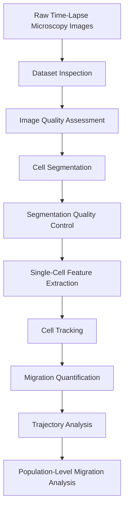
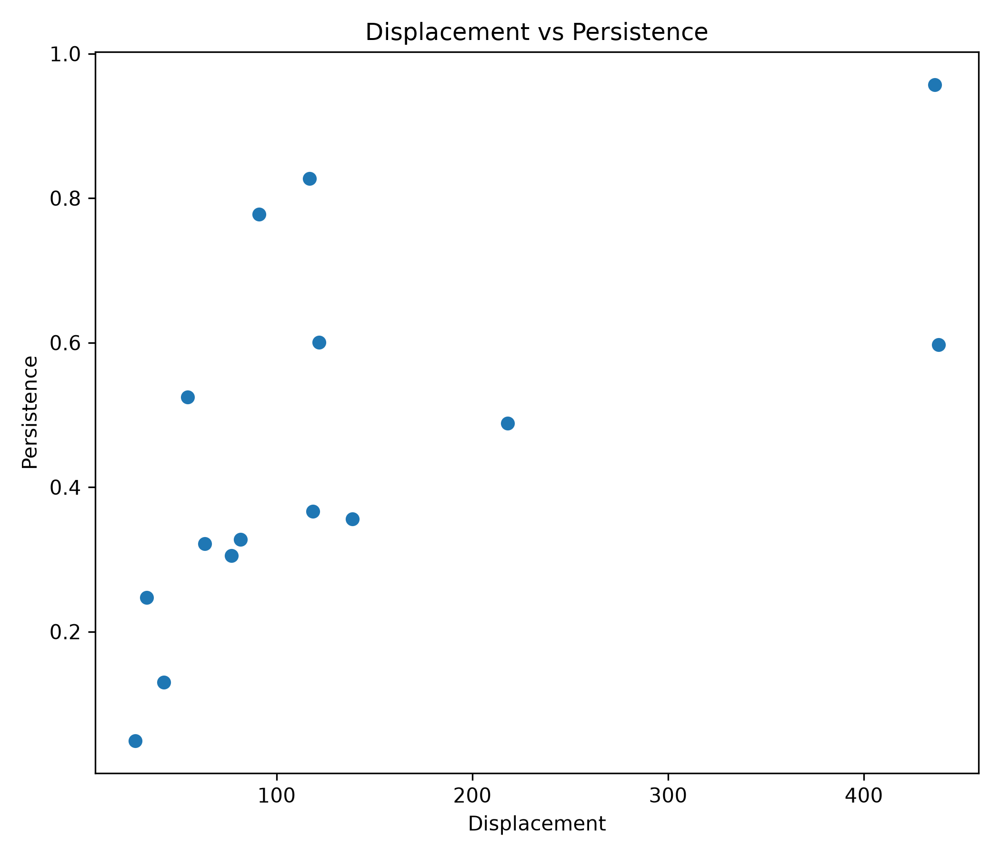
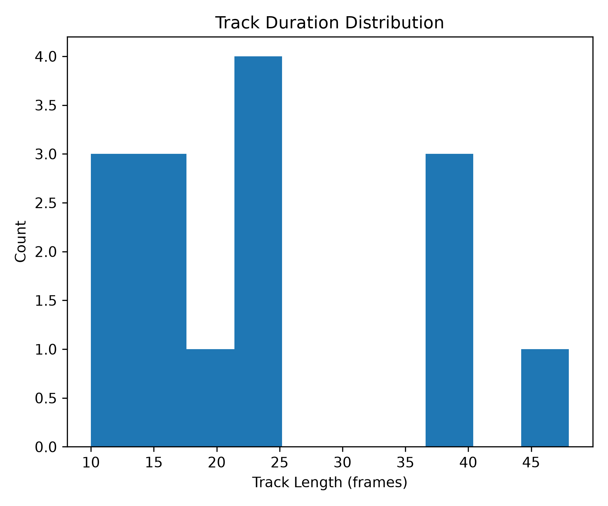

# Cell Tracking and Migration Analysis

A Python workflow for cell segmentation, quantitative tracking, migration analysis, trajectory visualization, and motility characterization in time-lapse microscopy datasets.

## Dataset Source

**Cell Tracking Challenge (CTC)**

**Dataset:** Fluo-C2DL-MSC
https://celltrackingchallenge.net/2d-datasets/

### Description

* Rat mesenchymal stem cells
* 2D fluorescence time-lapse microscopy
* Standard benchmark for cell segmentation and tracking algorithms
* Widely used for quantitative migration and cell tracking evaluation

---



---

## Installation

Install Anaconda or Miniconda.

Create a conda environment:

```bash
conda create -n celltrack python=3.11
conda activate celltrack
```

Install dependencies:

```bash
pip install -r requirements.txt
```

Please save the dataset folder in `./Data` before starting the analysis.

---

## Dataset exploration and image inspection

```bash
python src/check_dataset.py
python src/dataset_summary.py
python src/dataset_overview.py
```

---

## Image quality control and intensity analysis

```bash
python src/intensity_analysis.py
python src/segmentation_qc.py
python src/object_count_qc.py
```

---

## Cell segmentation and measurement extraction

```bash
python src/segmentation_preview.py
python src/cell_measurements.py
python src/cellpose_preview.py
python src/cellpose_full_movie.py
```

The segmentation workflow uses Cellpose to identify individual cells and extract quantitative morphological measurements including:

- Area
- Perimeter
- Centroid coordinates
- Shape descriptors
- Cell counts

---

## Cell tracking and migration quantification

```bash
python src/track_cells.py
python src/migration_metrics.py
```

Tracked cells are linked across consecutive frames using centroid-based nearest-neighbor association.

Migration metrics include:

- Track duration
- Path length
- Net displacement
- Mean speed
- Persistence
- Directionality

---

## Trajectory visualization and motility analysis

```bash
python src/migration_figures.py
python src/publication_figures.py
```

The workflow generates:

- Origin-normalized trajectories
- Mean Squared Displacement (MSD) curves
- Displacement vs persistence plots
- Track duration distributions
- Publication-ready summary figures

---

## Clone assignment and population analysis

```bash
python src/clone_assignment.py
```

Cells present in the initial frame can be grouped using spatial clustering to generate computational clone assignments for exploratory analysis of population organization and migration behavior.

---

## Results

### Dataset Overview


Representative frames extracted from the beginning, middle, and end of the experiment.

---

### Cellpose Segmentation


Automated segmentation masks generated using Cellpose with contour overlays on raw microscopy images.

---

### Origin-Normalized Cell Trajectories


Individual cell trajectories translated to a common origin for comparison of migration behavior.

---

### Mean Squared Displacement


Population-level motility characterized using Mean Squared Displacement analysis.

---

### Displacement vs Persistence



Relationship between migration efficiency and directional persistence across tracked cells.

---

### Track Duration Distribution



Distribution of cell tracking durations across the dataset.

---

## Applications

- Cell migration studies
- Live-cell imaging analysis
- Motility phenotyping
- Bioimage analysis workflows
- Quantitative microscopy
- Cell tracking benchmarking
- Computational biology education
