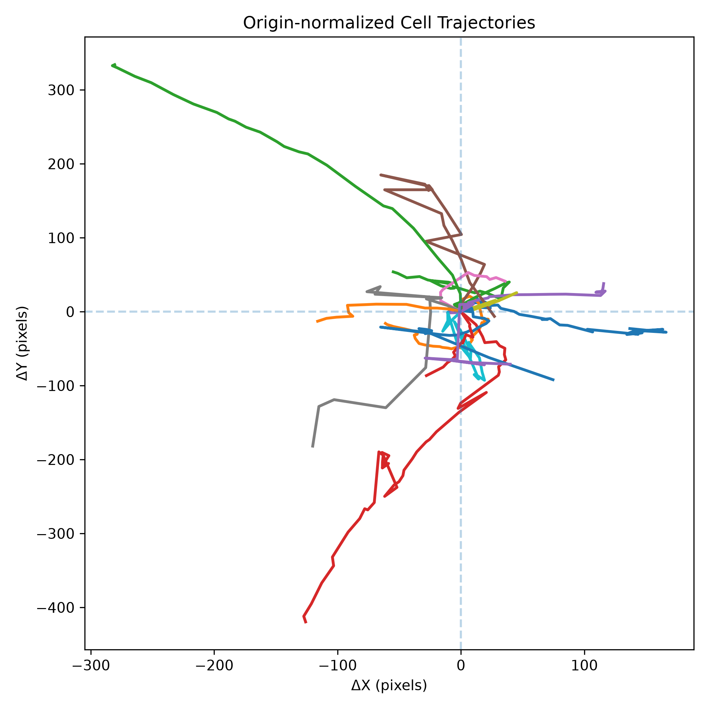
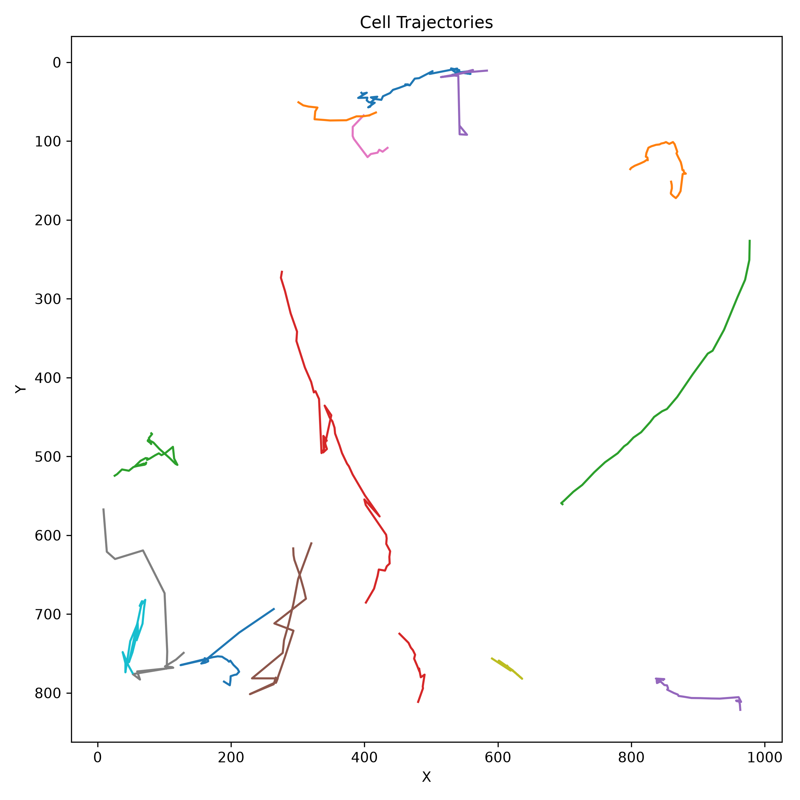
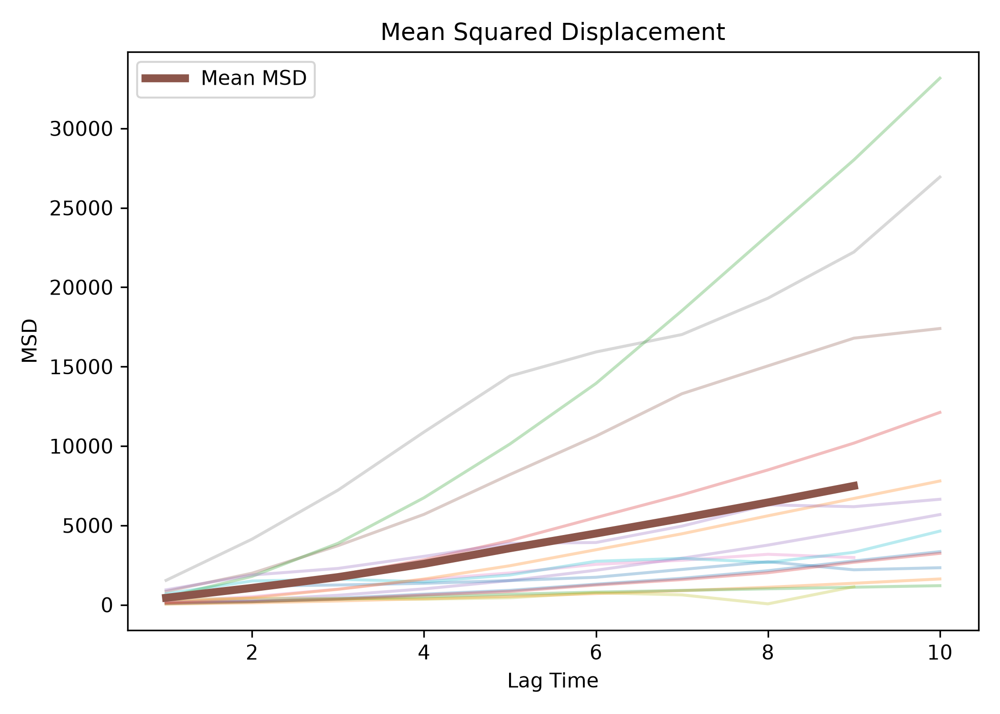
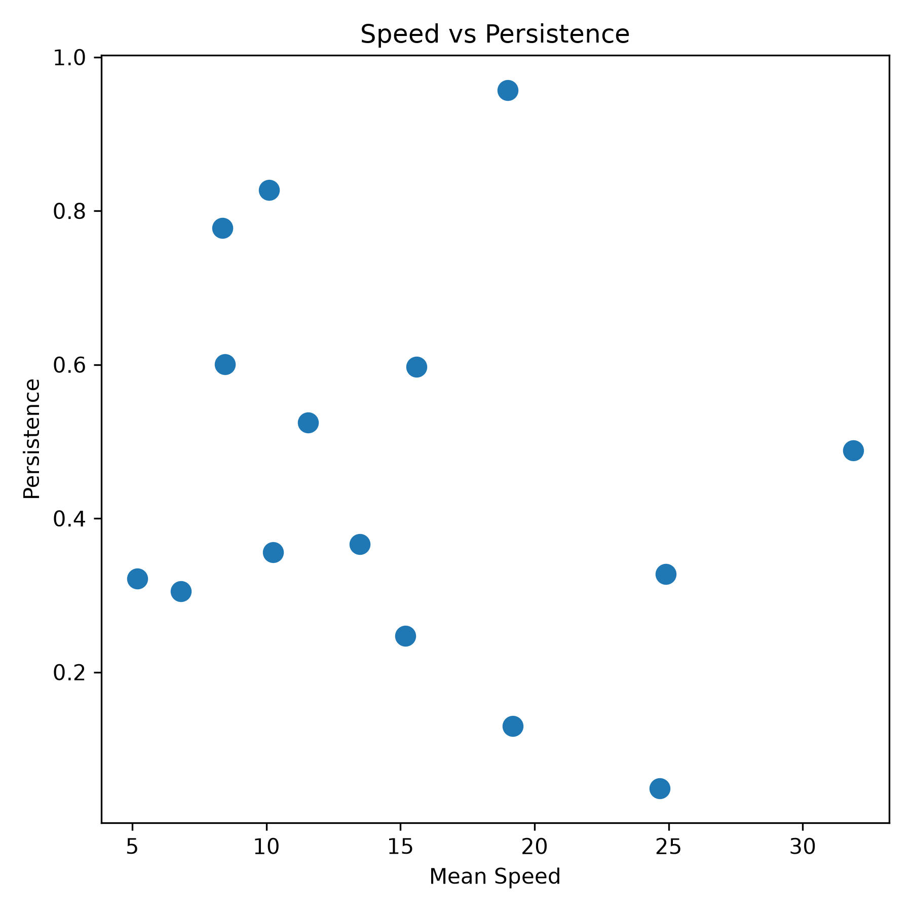

## Results

### Dataset Quality Assessment

I wanted to first examine the time-lapse sequence to verify image consistency and signal stability throughout acquisition. Mean image intensity remained relatively stable across frames, so subsequent segmentation and tracking analyses were not substantially affected by photobleaching or acquisition artifacts.

Figure 1: dataset_overview.png

### Accurate Segmentation of Individual Cells

Cellpose-based segmentation successfully identified individual cells throughout the imaging sequence. Visual inspection to confirm that the majority of cell boundaries were correctly detected, producing high-quality instance masks suitable for downstream quantitative analysis.

 

Figure 2: segmentation_preview.png

### Trajectory Reconstruction Enables Longitudinal Analysis of Cell Behavior

Tracking algorithms successfully linked segmented cells across consecutive frames, generating trajectories that describe cellular motion throughout the experiment.

Trajectory visualization--substantial variability in migration behavior, with some cells remaining relatively stationary while others exhibited directed movement over long distances.

Figure 3: origin_normalized_trajectories.png 

Figure 3: trajectory_plot.png

  
### Mean Squared Displacement Reveals Active Migration Behavior

Mean squared displacement (MSD) increased progressively with time lag-- sustained cell motility rather than purely random positional fluctuations.

MSD analysis provides a quantitative framework for distinguishing between diffusive and directed migratory behaviors.

Figure 4: MSD.png

### Speed and Persistence are Partially Coupled

Comparison of migration speed and persistence -- faster cells generally tend to exhibit more persistent migration trajectories, although substantial variability remained across the population.

Indicates coexistence of multiple migration phenotypes within the same culture.

Figure 5: speed_vs_persistence.png

